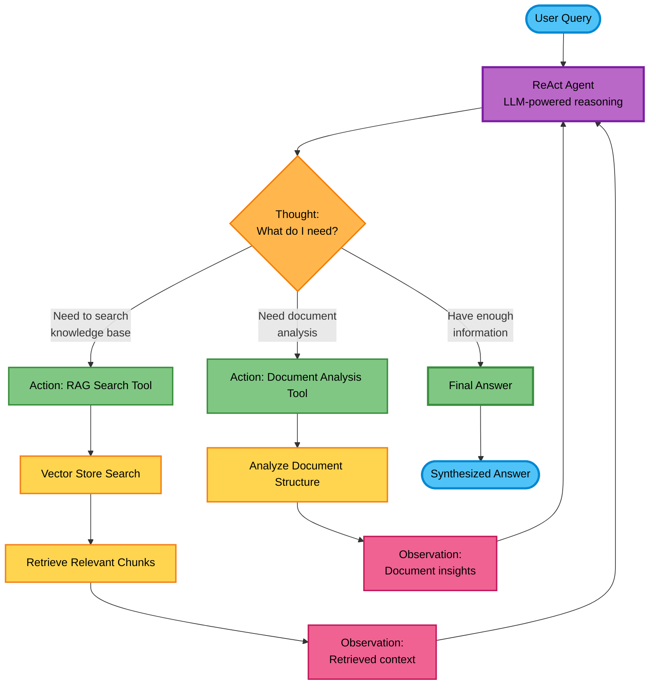

# Custom RAG System

A production-ready Retrieval-Augmented Generation (RAG) system with multi-agent capabilities, built on LangChain with support for multiple LLM providers and embedding models.

## Features

- **🤖 Multiple Query Processing Modes**: Vector Search, LLM Response, Agentic RAG
- **📊 Multiple Embedding Models**: OpenAI and Google embedding models
- **🔧 Multiple Chunking Strategies**: From simple character-based to semantic chunking
- **🌐 Web Interface**: Admin panel for testing and chat interface for queries
- **🔗 API Gateway Support**: Enterprise-ready with configurable API gateway integration
- **⚡ Agentic RAG System**: Advanced reasoning with specialized tools

## Quick Start

### Prerequisites

- Python 3.8+
- OpenAI or Google API key

### Installation

1. **Clone the repository**:
```bash
git clone <repository-url>
cd custom-rag
```

2. **Install dependencies**:
```bash
# Using uv (recommended)
uv sync

# Or using pip
pip install -r requirements.txt
```

3. **Configure environment**:
```bash
cp .env.example .env
```

Edit `.env` file:
```bash
# Required: Your API key (for API Gateway or direct provider access)
API_KEY=your_api_key_here

# Optional: Gateway Base URL (models.yaml defines specific gateway paths)
BASE_URL=https://api.your-gateway.com

# Optional: Default models (can override YAML config defaults)
DEFAULT_LLM_PROVIDER=openai
DEFAULT_LLM_MODEL=gpt-4
DEFAULT_EMBEDDING_MODEL=text-embedding-3-small
```

### Run the Application

```bash
python main.py
```

Open your browser to:
- **Chat Interface**: http://localhost:8000
- **Admin Panel**: http://localhost:8000/upload

## Usage

### 1. Upload Documents
1. Go to Admin Panel (http://localhost:8000/upload)
2. Upload PDF, DOCX, XLSX, or TXT files
3. Select chunking strategy (recommended: "Recursive Character")
4. Click "Upload Files"

### 2. Configure Models
In Admin Panel:
- **Embedding Model**: Choose from available OpenAI and Google models
- **LLM Model**: Select OpenAI (GPT) or Google (Gemini)

### 3. Query Your Documents

**Chat Interface** (http://localhost:8000):
- Select query mode in right sidebar:
  - **🔍 Vector Search**: Fast document retrieval (~100-200ms)
  - **🤖 LLM Response**: Intelligent answers (~1-3 seconds)
  - **🧠 Agentic RAG**: Multi-step analysis (~3-10 seconds)

**Admin Panel** - Test different modes with instant results

## Available Models

### Embedding Models
- **OpenAI Models**: text-embedding-3-small, text-embedding-3-large, text-embedding-ada-002
- **Google Models**: models/embedding-001, models/text-embedding-004

### LLM Models
- **OpenAI**: GPT-4, GPT-3.5-turbo, and other GPT models
- **Google**: Gemini Pro, Gemini Flash models

### Chunking Strategies
- **recursive_character**: Best for most documents
- **character**: Simple character-based splitting
- **token_based**: Based on tokenizer limits
- **sentence_transformers_token**: Optimized for embeddings
- **word_based**: Word boundary splitting
- **sentence_based**: Sentence boundary splitting
- **paragraph_based**: Paragraph boundary splitting
- **semantic_based**: Meaning-based chunking
- **fixed_size**: Fixed character size chunks

## Configuration

### Environment Variables
- `API_KEY`: Your API key for API Gateway or direct provider access (required)
- `BASE_URL`: Optional gateway base URL (models.yaml defines specific paths)
- `DEFAULT_LLM_PROVIDER`: openai or google (defaults from config/models.yaml)
- `DEFAULT_LLM_MODEL`: Model name (defaults from config/models.yaml)
- `DEFAULT_EMBEDDING_MODEL`: Embedding model (defaults from config/models.yaml)

### Configuration Files
- `config/models.yaml`: Centralized model configuration with gateway URLs and custom headers
- `.env`: Environment variables for API keys and optional overrides

### API Gateway Support
The system supports API Gateway integration with configurable header format:
- **Headers**: Customizable via `config/models.yaml` (e.g., `{"api-key": "your_key", "ai-gateway-version": "v2"}`)
- **Configuration**: Automatically handled via `config/models.yaml`
- **Models**: All LLM and embedding models support API Gateway routing
- **Fallback**: Direct provider URLs when BASE_URL is not configured

### File Support
- **PDF**: Text extraction with layout preservation
- **DOCX**: Microsoft Word documents
- **XLSX**: Excel spreadsheets (text content)
- **TXT**: Plain text files

## Architecture

### System Design


**Technology Stack:**
- **Backend**: FastAPI with async support
- **AI Framework**: LangChain for model integration
- **Vector Database**: ChromaDB for semantic search
- **Frontend**: Bootstrap 5 with vanilla JavaScript
- **Real-time**: WebSocket for chat functionality

### Design Principles
- **Interface-First Design**: Modular components with well-defined interfaces
- **Dependency Injection**: Loose coupling for enhanced testability
- **Factory Pattern**: Configuration-driven component creation
- **Mock Support**: Complete mock implementations for isolated testing
- **Provider Agnostic**: Easy to swap LLM and embedding providers

## Agentic RAG System

### Overview

The Agentic RAG system uses a **ReAct (Reasoning and Acting) pattern** to intelligently process complex queries through multi-step reasoning. Unlike simple RAG systems that perform a single retrieval and generation step, the Agentic RAG can:

- **Reason** about what information is needed
- **Plan** multiple retrieval steps
- **Act** using specialized tools
- **Synthesize** information from multiple sources
- **Self-correct** based on retrieved information

### How It Works

The agent uses a **thought → action → observation loop** to iteratively gather information and reason about the answer:

1. **Thought**: Agent analyzes the question and decides what to do next
2. **Action**: Agent selects and executes a tool (search knowledge base, analyze documents)
3. **Observation**: Agent processes the tool's output
4. **Repeat**: Agent continues thinking and acting until it has enough information
5. **Answer**: Agent synthesizes all observations into a final answer

### Agentic RAG Workflow



### Available Agent Tools

#### 1. RAG Search Tool
- **Purpose**: Search the knowledge base using semantic similarity
- **Input**: Search query or question
- **Output**: Relevant document chunks with context
- **Use Case**: Finding specific information across documents

#### 2. Document Analysis Tool
- **Purpose**: Analyze document structure, metadata, and relationships
- **Input**: Document ID or search criteria
- **Output**: Document insights, statistics, and summaries
- **Use Case**: Understanding document organization and extracting metadata

### Agentic RAG vs Standard RAG

| Feature | Standard RAG | Agentic RAG |
|---------|-------------|-------------|
| **Retrieval** | Single-step retrieval | Multi-step iterative retrieval |
| **Reasoning** | No reasoning | ReAct reasoning loop |
| **Tools** | Fixed retrieval | Multiple specialized tools |
| **Complexity** | Simple queries | Complex, multi-part queries |
| **Response Time** | ~1-3 seconds | ~3-10 seconds |
| **Accuracy** | Good for direct questions | Better for complex analysis |

### Example Query Flow

**Query**: "What are the key differences between the Q1 and Q2 financial reports?"

```
Thought: I need to find Q1 and Q2 financial reports first
Action: RAG Search Tool - "Q1 financial report"
Observation: Found Q1 report with revenue data

Thought: Now I need Q2 report to compare
Action: RAG Search Tool - "Q2 financial report"
Observation: Found Q2 report with revenue data

Thought: I should analyze both documents for detailed comparison
Action: Document Analysis Tool - Compare Q1 and Q2 documents
Observation: Identified key metrics: revenue, expenses, profit margins

Thought: I have enough information to answer
Final Answer: [Synthesized comparison of Q1 vs Q2 with specific metrics]
```

### When to Use Agentic RAG

**Use Agentic RAG for:**
- ✅ Multi-document comparison and analysis
- ✅ Complex queries requiring multiple retrieval steps
- ✅ Questions needing document structure understanding
- ✅ Queries requiring synthesis of disparate information
- ✅ Research-style questions with follow-up analysis

**Use Standard LLM Response for:**
- ✅ Direct, single-answer questions
- ✅ Simple fact retrieval
- ✅ Speed-critical applications
- ✅ Straightforward document queries

**Use Vector Search for:**
- ✅ Finding similar documents
- ✅ Fastest retrieval needs
- ✅ When you just need relevant chunks without LLM processing

## Troubleshooting

### Common Issues

1. **Import Errors**: Ensure all dependencies are installed with `uv sync`

2. **API Key Errors**: Check your `.env` file has the correct `API_KEY`

3. **Model Not Found**: Verify the model name in your configuration

4. **Upload Failures**: Check file format is supported (PDF, DOCX, XLSX, TXT)

5. **Slow Responses**: Agentic RAG mode takes longer (~3-10 seconds)

### Getting Help

- Check the Admin Panel for system status
- Review logs in the terminal output
- Verify API key and model configuration
- Ensure documents are uploaded successfully before querying