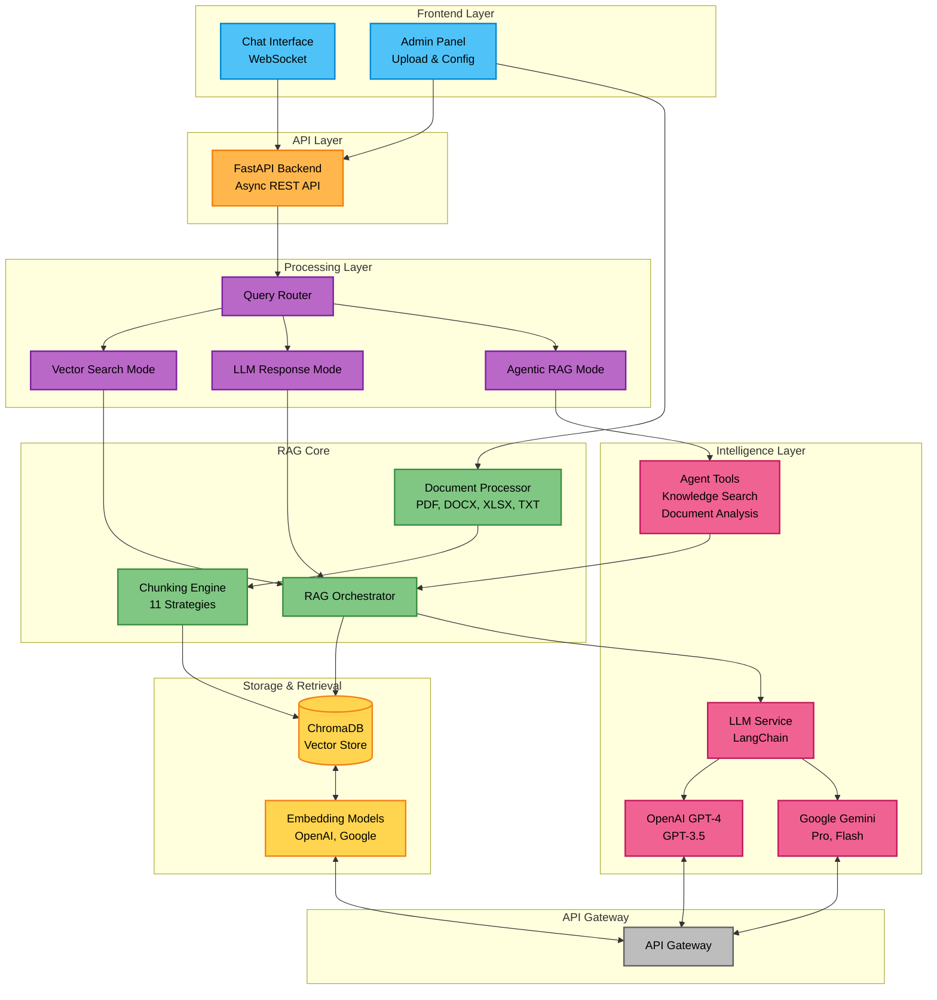

# Custom RAG System

Production-ready RAG system with AI-powered chunking, hybrid search, and multi-agent capabilities.

## Features

- **🔍 Hybrid Search**: Combines vector similarity + AI metadata matching (keywords, topics, entities)
- **🧠 AI-Powered Chunking**: LLM analyzes documents for optimal semantic chunking
- **🤖 Agentic RAG**: Multi-step reasoning for complex queries
- **📊 Multiple Models**: OpenAI and Google embeddings/LLMs
- **🌐 Web Interface**: Chat UI and admin panel
- **⚡ API Gateway Support**: Enterprise-ready

## Quick Start

### Prerequisites
- Python 3.8+
- OpenAI or Google API key

### Installation

```bash
# Clone repository
git clone <repository-url>
cd custom-rag

# Install dependencies
uv sync
# or: pip install -r requirements.txt

# Configure environment
cp .env.example .env
```

Edit `.env`:
```bash
API_KEY=your_api_key_here
BASE_URL=https://api.your-gateway.com  # Optional
DEFAULT_LLM_MODEL=gpt-4
DEFAULT_EMBEDDING_MODEL=text-embedding-3-small
```

### Run

```bash
python main.py
```

Open browser:
- **Chat**: http://localhost:8000
- **Admin**: http://localhost:8000/upload

## Usage

### 1. Upload Documents
1. Go to Admin Panel
2. Upload PDF, DOCX, XLSX, or TXT files
3. Select chunking strategy:
   - **Recursive Character** (recommended for speed)
   - **LLM Enhanced** (best quality, uses AI)
4. Choose metadata detail level (for LLM strategies):
   - **Basic**: Keywords + summary
   - **Detailed**: + Topics + entities
   - **Comprehensive**: + Sentiment + facts

### 2. Query Documents
Select query mode:
- **🔍 Vector Search**: Fast (~100ms)
- **🤖 LLM Response**: Intelligent answers (~1-3s) - **uses hybrid search**
- **🧠 Agentic RAG**: Complex analysis (~3-10s)

## Chunking Strategies

### AI-Powered (Recommended)
- **llm_enhanced**: Fast chunking + AI refinement + optional metadata
  - Uses Recursive Character splitter, then LLM improves boundaries
  - **Enables hybrid search** with metadata matching
  - ~2-5 seconds per document

- **llm_semantic**: Full AI semantic chunking
  - LLM identifies natural boundaries
  - Best quality, slower (~5-10 seconds)

### Standard (Fast)
- **recursive_character**: LangChain's best splitter (recommended)
- **token_based**: GPT tokenizer-based
- **sentence_based**: Preserves sentence boundaries
- **paragraph_based**: Preserves paragraph structure

## Hybrid Search

When you use **LLM chunking with metadata**, the system automatically uses **hybrid search**:

**Traditional Search**: Only vector similarity (semantic meaning)
**Hybrid Search**: Vector (70%) + Metadata (30%) matching

### Metadata Scoring
- **Keywords** (30%): Matches `llm_keywords`
- **Topics** (25%): Matches `llm_topic`
- **Entities** (25%): Matches `llm_entities` (people, places, organizations)
- **Title** (20%): Matches `llm_title`

### Result
**15-30% better relevance** for keyword/entity queries!

## Configuration Files

- `.env`: API keys and defaults
- `config/models.yaml`: Model configurations and gateway URLs

## Supported Files

- PDF, DOCX, XLSX, TXT

## Architecture

### System Design



### Agentic RAG Workflow


### Query Flow

```
User Query
    ↓
Hybrid Search (if AI metadata available)
    ├─ Vector Similarity (70%)
    └─ Metadata Matching (30%)
    ↓
ChromaDB → Retrieve Chunks
    ↓
LLM (GPT/Gemini) → Generate Response
    ↓
Return with Sources
```

## When to Use What

| Use Case | Chunking | Query Mode |
|----------|----------|------------|
| General documents | Recursive Character | LLM Response |
| Legal/Financial | LLM Enhanced + Detailed | LLM Response |
| Technical docs | LLM Enhanced + Basic | LLM Response |
| Speed critical | Recursive Character | Vector Search |
| Complex analysis | LLM Semantic + Comprehensive | Agentic RAG |

## Troubleshooting

**Import Errors**: Run `uv sync`
**API Key Errors**: Check `.env` file
**Upload Failures**: Verify file format (PDF, DOCX, XLSX, TXT)
**Slow Responses**: Agentic RAG takes 3-10 seconds (normal)

## Technology Stack

- **Backend**: FastAPI (async)
- **AI**: LangChain + OpenAI/Google
- **Vector DB**: ChromaDB
- **Frontend**: Bootstrap 5 + WebSocket
