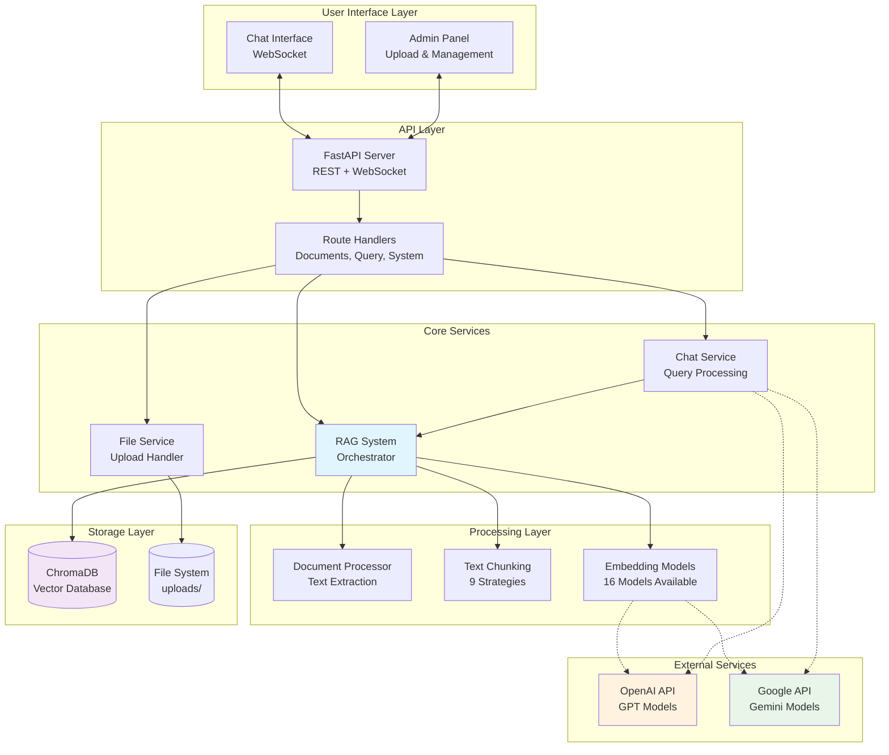
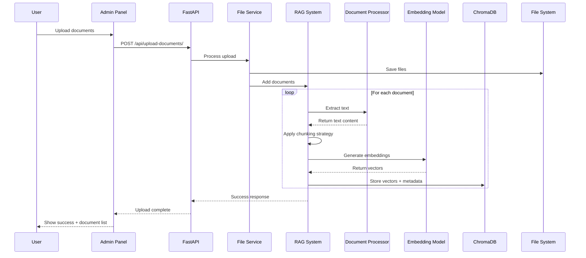
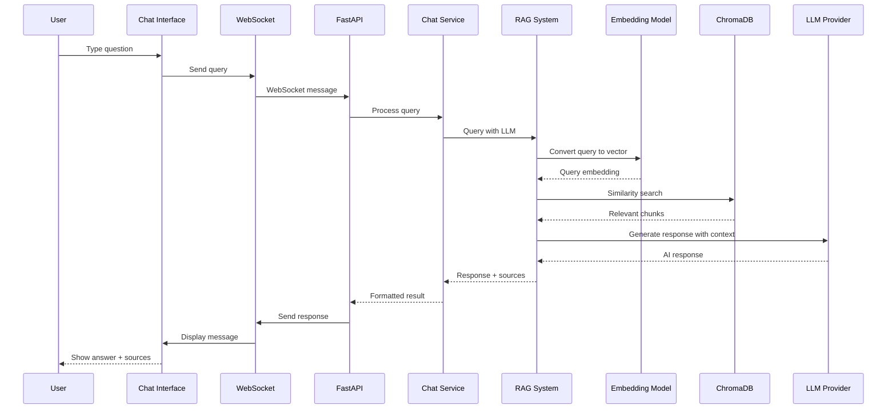
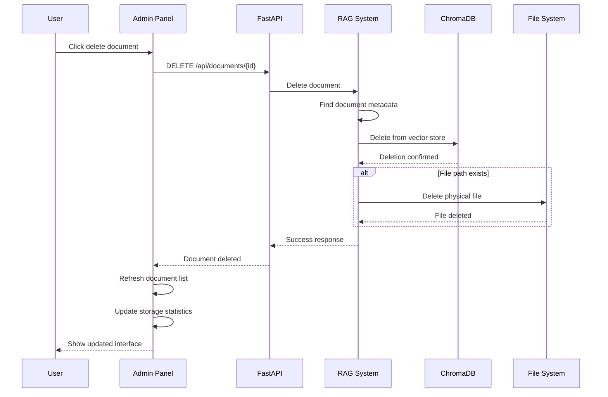

# Custom RAG System

A modern, full-stack Retrieval-Augmented Generation (RAG) system with intelligent document processing, semantic search, and AI-powered chat interface.

## 🌟 Key Features

- **📄 Multi-format document support** - PDF, DOCX, XLSX, TXT
- **🔍 Semantic search** - Vector-based similarity search with 16 embedding models
- **🤖 AI-powered responses** - OpenAI GPT & Google Gemini integration
- **💬 Real-time chat** - WebSocket-based instant messaging
- **🎛️ Admin panel** - Document management, model configuration, system monitoring
- **🛡️ Permanent deletion** - Complete cleanup of documents and files
- **📊 Visual interface** - Modern Bootstrap UI with drag-and-drop uploads

## 🏗️ System Architecture



## 🔄 Workflow Sequence Diagrams

### Document Upload & Processing Workflow



### Query & Response Workflow



### Document Deletion Workflow



## 🚀 Quick Start

### Prerequisites
- Python 3.13+
- uv package manager (recommended)

### Installation

1. **Clone and setup**:
   ```bash
   git clone <repository-url>
   cd custom-rag
   uv sync
   ```

2. **Configure environment** (optional):
   ```bash
   # Create .env file for API keys
   echo "OPENAI_API_KEY=your_key_here" > .env
   echo "GOOGLE_API_KEY=your_key_here" >> .env
   ```

3. **Run the application**:
   ```bash
   python main.py
   ```

4. **Access the interface**:
   - 🏠 **Main Chat**: http://localhost:8000
   - ⚙️ **Admin Panel**: http://localhost:8000/upload
   - 📚 **API Docs**: http://localhost:8000/docs

## 💻 Usage

### 1. Upload Documents
- Navigate to **Admin Panel** (http://localhost:8000/upload)
- Drag & drop files or click to browse
- Configure chunking strategy and embedding model
- Wait for processing to complete

### 2. Chat with Documents
- Go to **Main Chat** (http://localhost:8000)
- Type questions about your uploaded documents
- Get AI-powered responses with source attribution

### 3. Manage System
- Use **Admin Panel** for:
  - Document library management
  - Embedding model configuration
  - LLM provider settings
  - System statistics monitoring

## 🎛️ Configuration Options

### Embedding Models (16 available)

| **Provider** | **Models** | **Cost** | **Privacy** | **Setup** |
|-------------|------------|----------|-------------|-----------|
| **Local (SentenceTransformers)** | 11 models | 🆓 Free | 🔒 Complete | ✅ None |
| **OpenAI** | 3 models | 💰 $0.02-0.13/1M tokens | ⚠️ External | 🔑 API Key |
| **Google** | 2 models | 🆓/💰 Free tier + Paid | ⚠️ External | 🔑 API Key |

**Recommended:**
- **Beginners**: `all-mpnet-base-v2` (default local model)
- **Speed**: `all-MiniLM-L6-v2` (fast local model)
- **Quality**: `text-embedding-3-large` (OpenAI, paid)

### LLM Providers

| **Provider** | **Models** | **Cost** | **Best For** |
|-------------|------------|----------|--------------|
| **OpenAI** | GPT-4o, GPT-4o-mini, GPT-3.5 | $0.15-15/1M tokens | Advanced reasoning |
| **Google** | Gemini 1.5 Pro/Flash | Free tier available | Cost-effective |

### Chunking Strategies (9 available)

| **Strategy** | **Best For** | **Description** |
|-------------|--------------|-----------------|
| **Recursive Character** ⭐ | Most documents | Intelligent multi-separator splitting |
| **Token-based** | LLM integration | Precise token count control |
| **Semantic-based** | Research docs | Advanced semantic splitting |
| **Sentence-based** | Q&A systems | Preserves sentence boundaries |

## 📁 Project Structure

```
src/
├── api/              # FastAPI routes and handlers
│   ├── chat.py       # Chat and query endpoints
│   ├── documents.py  # Document management APIs
│   ├── system.py     # System configuration APIs
│   └── upload.py     # File upload handling
├── ui/               # User interface components
│   ├── templates/    # Jinja2 HTML templates
│   ├── static/       # CSS, JS, assets
│   ├── chat_ui.py    # WebSocket chat interface
│   └── upload_ui.py  # Upload interface logic
├── embedding/        # Vector embeddings and storage
│   ├── models.py     # Embedding model factory
│   ├── vector_store.py # ChromaDB wrapper
│   └── chunking.py   # Text chunking strategies
├── llm/              # Language model integrations
│   └── models.py     # LLM provider factory
├── upload/           # Document processing
│   ├── document_processor.py # Text extraction
│   └── file_service.py       # Upload handling
├── config.py         # Configuration management
└── rag_system.py     # Main orchestrator
```

## 🔗 API Endpoints

### Core APIs
- `GET /` - Main chat interface
- `GET /upload` - Admin panel
- `POST /api/upload-documents/` - Upload documents
- `POST /api/query/` - Query documents
- `GET /api/documents/` - List documents
- `DELETE /api/documents/{id}` - Delete document
- `GET /api/system/stats` - System statistics

### WebSocket
- `WS /ws/chat` - Real-time chat communication

## 🛠️ Technology Stack

### Backend
- **FastAPI** - Modern Python web framework
- **ChromaDB** - Vector database
- **Sentence-Transformers** - Embedding models
- **LangChain** - Text processing
- **OpenAI/Google APIs** - LLM integration

### Frontend
- **Bootstrap 5** - UI framework
- **Vanilla JavaScript** - Client-side logic
- **WebSocket** - Real-time communication
- **Jinja2** - Template engine

### Storage & Processing
- **SQLite** (ChromaDB) - Vector storage
- **File System** - Document storage
- **AsyncIO** - Concurrent processing

## 🔒 Security Features

- ✅ File type validation
- ✅ Path traversal protection
- ✅ Input sanitization
- ✅ Secure WebSocket connections
- ✅ API key protection
- ✅ Permanent file deletion

## 📈 Performance Tips

1. **Model Selection**: Choose embedding models based on speed vs. accuracy needs
2. **Chunking Strategy**: Adjust chunk size for document types (500-2000 words)
3. **Batch Processing**: Upload multiple documents simultaneously
4. **Cache Management**: Vector database automatically optimizes storage

## 🤝 Contributing

1. Fork the repository
2. Create feature branch (`git checkout -b feature/amazing-feature`)
3. Commit changes (`git commit -m 'Add amazing feature'`)
4. Push to branch (`git push origin feature/amazing-feature`)
5. Open a Pull Request

## 📝 License

This project is licensed under the MIT License - see the [LICENSE](LICENSE) file for details.

## 🆘 Support

- 📚 **Documentation**: Check the inline API docs at `/docs`
- 🐛 **Issues**: Report bugs via GitHub Issues
- 💡 **Feature Requests**: Use GitHub Discussions
- 📧 **Contact**: Create an issue for support

---

**Built with ❤️ using FastAPI, ChromaDB, and modern AI technologies**